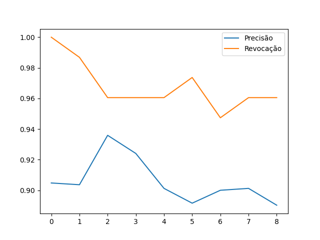
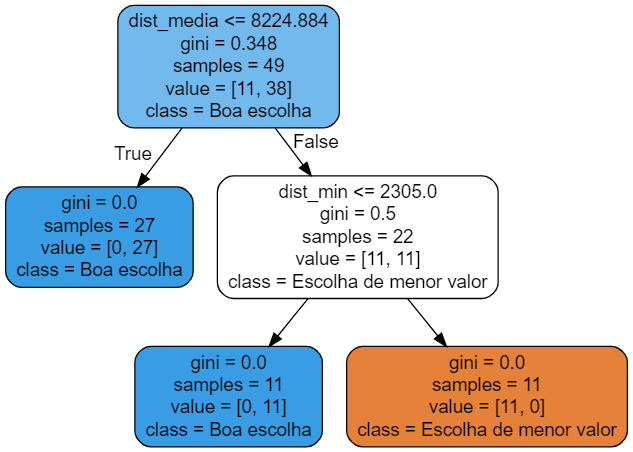

# ArvoreDeDecis-oAirbnb
Tendo em vista a base gerada da última análise, farei uma árvore de decisão para definir se o airbnb é uma boa escolha ou não com base na distância média e distância mínima a um estabelecimento desejado

Importando os pacotes

```
from sklearn.tree import DecisionTreeClassifier
from sklearn.model_selection import cross_val_predict
from sklearn.metrics import precision_score, recall_score
from sklearn.model_selection import train_test_split
from sklearn.metrics import roc_curve
from sklearn.metrics import roc_auc_score
import pandas as pd
from graphviz import Source
from sklearn.tree import export_graphviz
import matplotlib.pyplot as plt
import os
import openpyxl
```
A função de salvar as figuras na pasta pode ser encontrada no repositório do autor [Aurélien Géron](https://github.com/ageron/handson-ml2/blob/master/06_decision_trees.ipynb), portanto não será comentada aqui.

Carregando a base de dados gerada do estudo anterior [Lista-de-Cafes](https://github.com/gabriellafeta/Lista-de-Cafes/blob/main/README.md?plain=1)
```
base_final_df = pd.read_excel("base_final_ordenada.xlsx")
```
Perceba que foi adicionada a coluna "Boa escolha" como uma variável binária baseada nos critérios de distância média e distância mínima
Agora será definida a árvore de decisão inicial de predição para a coluna "Boa escolha"

```
X = base_final_df[["dist_media", "dist_min"]]
y = base_final_df["Boa escolha"]

clasf_boa_escolha = DecisionTreeClassifier(max_depth=2, random_state=42)
```

Utilizamos um valor de max_depth=2 para simplificar o modelo dado o número de variáveis

Implementando a predição cruzada com o SciKit-Learn
Primeiro avaliaremos o efeito do número de folds na precisão e revocação

```
lista_precisao = []
lista_revocacao = []

for k in [2, 3, 4, 5, 6, 7, 8, 9, 10]:
    y_prev = cross_val_predict(clasf_boa_escolha, X, y, cv=k)
    precisao = precision_score(y, y_prev)
    revocacao = recall_score(y, y_prev)
    lista_precisao.append(precisao)
    lista_revocacao.append(revocacao)
```

Avaliando graficamente o comportamento da precisão e revocação para os diferentes valores de k

```
plt.plot(lista_precisao, label='Precisão')
plt.plot(lista_revocacao, label='Revocação')
plt.legend()
plt.show()
```



Considerando o tamanho da base de dados e o contexto será utilizado k=2, dado que prioriza um alto valor de precisão.
Nesse contexto, apesar de ter um bom valor de revocação, prioriza-se precisão, pois o objetivo é direcionar a escolha de um único airbnb ideal para uma viagem, portanto é melhor garantir apenas os seguros.

O valor de k=2 indica que o conjunto de treino e de testes tem que conter metade das amostras

X_train, X_test, y_train, y_test = train_test_split(X, y, test_size=0.5, random_state=42)

Treinando algoritmo com conjunto de treinamento e calculando a precisão:

```
clasf_boa_escolha.fit(X_train, y_train)
y_prev_final = clasf_boa_escolha.predict(X_test)

precisao_final = precision_score(y_test, y_prev_final)

print(precisao_final)
>>> 0.9743589743589743
```
A função para exportar a árvore de decisão também pode ser encontrada no repositório [Aurélien Géron](https://github.com/ageron/handson-ml2/blob/master/06_decision_trees.ipynb).



Por fim será plotada a curva ROC e calculada a área sobre a curva como parâmetro de desempenho:

```
y_prev_k2 = cross_val_predict(clasf_boa_escolha, X, y, cv=2)
taxa_falso_positivo, taxa_verd_positivo, limiar = roc_curve(y_train, y_prev_final)

# Calcular a taxa de falso positivo, taxa de verdadeiro positivo e limiar para a curva ROC
fpr, tpr, thresholds = roc_curve(y_test, y_prev_final)

# Plotar a curva ROC
plt.plot(fpr, tpr)
plt.xlabel('Taxa de Falso Positivo')
plt.ylabel('Taxa de Verdadeiro Positivo')
plt.title('Curva ROC')
plt.show()
```


Por fim, calculando a área sob a curva:

```
area = roc_auc_score(y_test, y_prev_final)
print(area)
>>> 0.9583333333333333
```

## Conclusão

Pelas duas métricas utilziadas o modelo utilziado apresenta eficiência satisfatória no dado contexto


